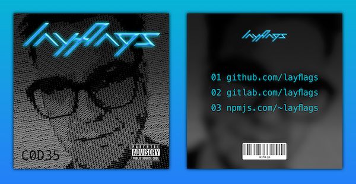

# [layfla.gs](https://www.layfla.gs)



This project is a [PWA](https://developers.google.com/web/progressive-web-apps/) and works even w/o stylesheets (just the information then) and w/o JS (no offline capabilities then).

## Local development

Start a development server with e.g.:
```
$ npx live-server
```

## Deployment on [Now](https://zeit.co/now)

```
$ ./deploy.sh
```
Needs [workbox](https://www.npmjs.com/package/workbox-cli) and [now](https://www.npmjs.com/package/now) installed globally.
